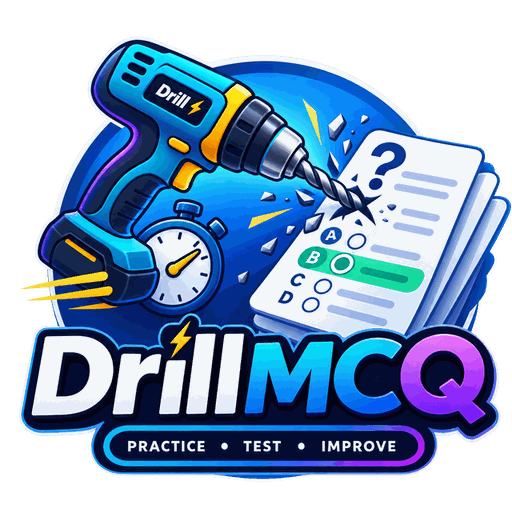

<div align="center">



<p><strong>Practice smarter. Test yourself.</strong></p>

<p>
  <a href="https://react.dev/"></a>
  <a href="https://www.typescriptlang.org/"></a>
  <a href="https://vite.dev/"></a>
  <a href="https://tailwindcss.com/"></a>
  <a href="#license"></a>
  <a href="https://thealiflab.github.io/DrillMCQ/"></a>
</p>

<hr />

<p>
  Paste quiz questions as plain text or JSON and get a professional online-exam
  experience — parsing, timing, scoring, and review, with an optional
  bring-your-own-key AI assistant.<br />
  <strong>No backend, no database: everything runs in your browser.</strong>
</p>

</div>

## Table of Contents

- [Features](#features)
- [Getting around](#getting-around)
- [Screenshots](#screenshots)
- [Tech Stack](#tech-stack)
- [Getting Started](#getting-started)
  - [Prerequisites](#prerequisites)
  - [Installation](#installation)
  - [Run locally](#run-locally)
  - [Build for production](#build-for-production)
  - [Lint](#lint)
  - [Test](#test)
- [Importing Questions](#importing-questions)
  - [Plain text format](#plain-text-format)
  - [Prompt template for AI-generated questions](#prompt-template-for-ai-generated-questions)
  - [Quiz JSON schema](#quiz-json-schema)
- [Check Answer](#check-answer)
- [Multiple correct answers](#multiple-correct-answers)
- [Data & Storage](#data--storage)
- [AI assistant (optional)](#ai-assistant-optional)
  - [About your API key](#about-your-api-key)
- [Deployment](#deployment)
  - [GitHub Pages](#github-pages)
  - [Vercel](#vercel)
- [Project Structure](#project-structure)
- [License](#license)

## Features

- **Plain-text MCQ import**: paste raw exam dumps or practice questions; a smart parser detects questions, options (A/B/C/D, a/b/c/d, numbered, bulleted), answers (inline or from an answer key at the bottom of the paste), explanations, and categories, with a live preview and per-line error/warning reporting. Common website and PDF clutter (ads, page numbers, "Show Answer" buttons, share widgets) is filtered out and reported as an ignored-lines count.
- **JSON import**: paste JSON into a textarea, with friendly validation errors
- **Multiple correct answers**: a question whose answer line lists more than one option (`Answer: A, C`) automatically becomes a "select all that apply" question with tick boxes. Nothing to configure, and single-answer questions are unaffected.
- **Check Answer**: every question can be checked on the spot — the correct answer is revealed, your selection is marked right or wrong (all of it, on a multi-answer question), and the question stays put for review. Optional, one-way, and the quiz never advances by itself.
- **Four clear destinations**: **Home**, **Create Quiz**, **Quiz Library**, and **Results** — a sticky header on desktop and a thumb-reachable bottom bar on phones
- **Home dashboard**: what to do next at a glance, plus a **Continue quiz** banner (with a progress bar) whenever an unfinished run is waiting
- **Guided import flow**: a **Paste → Review → Start** step indicator so it is obvious where you are and what comes next
- **Professional quiz engine**: one question at a time, progress bar, next/previous navigation
- **Distraction-free quiz screen**: while you are answering, the navigation is replaced by a slim bar showing the quiz name, timer, position, and progress — the only way out is a labelled back button behind a confirmation, so a stray tap can't abandon a run
- **Keyboard navigation**: `←`/`→` to move between questions, `1–8` or `A–H` to select answers (they tick and untick on a multi-answer question), `Enter` to check the current question
- **Results & review**: score percentage in a circular ring, per-question review with correct/incorrect indicators
- **Pass/fail threshold**: set a pass mark (default 70%) before the quiz starts; the result screen shows **PASS** or **FAIL** against it, with a brief, dismissible confetti celebration on a pass
- **Explanations**: optional expandable explanation per question
- **Quiz library**: save imported quizzes to your **Quiz Library**, with question count, categories, best score, attempts, and status (not started / in progress / completed). Rename, start over, view results, or delete from a per-card menu
- **Resume**: leave or refresh mid-quiz and pick up from home or the library exactly where you left off, with answers, position, timer, and settings intact
- **Results history**: every completed attempt is kept locally, on its own **Results** screen and per quiz, with latest / best / average scores and a full review of any past attempt
- **Session persistence**: progress, answers, and timer survive a page refresh (localStorage)
- **Timer mode**: optional countdown that auto-submits when time runs out
- **Shuffle**: optionally shuffle questions and/or options
- **Category filtering**: pick which categories to include before starting
- **Review tools**: filter to incorrect answers only, search questions
- **JSON export**: download the loaded quiz as a JSON file from the results screen
- **Dark/light mode**: toggle from the header or the ⚙️ **Settings** dialog, with saved preference (respects OS preference by default)
- **Sound effects**: short tones for the moments that carry meaning — a rising chime for a correct answer and a soft falling one for a wrong answer, a fanfare or a quiet closing tone at the end of a run, and light clicks on selecting, paging, saving and confirming a delete. On by default and switchable off in **Settings**. The tones are generated in the browser with the Web Audio API, so nothing is downloaded and the app stays asset-free
- **Optional AI assistant**: bring your own key to tidy a messy paste, repair broken JSON, double-check answers, or explain a result — off by default, and every request is a deliberate button press
- **Mobile-first and responsive**: touch-sized targets, safe-area aware bottom navigation, and layouts that scale up to desktop

## Getting around

The app has exactly four destinations, in the header on desktop and in a bottom
bar on phones:

| Destination      | What lives there                                                                                  |
| ---------------- | ------------------------------------------------------------------------------------------------- |
| 🏠 **Home**      | A short intro, the four things you can do, a **Continue quiz** banner for any unfinished run, and your most recent results |
| ➕ **Create Quiz** | The **Plain text** / **JSON** importer, the live preview, and the setup options                    |
| 📚 **Quiz Library** | Every saved quiz: start, continue, start over, rename, view its results, or delete                |
| 📊 **Results**   | Every completed attempt across all quizzes, including quizzes never saved to the library            |

⚙️ **Settings** (header) holds **Appearance** — dark/light mode, a background
preset (Slate, Warm, Cool, High contrast), the font (Sans, Serif, Monospace,
Readable) and the text size — plus **Sound effects** and the optional AI
assistant. Every appearance choice applies instantly, is remembered in this
browser, and can be undone with **Reset**. The background presets compose with
dark mode rather than replacing it, and the fonts are system stacks, so nothing
is ever downloaded. Sound sits in its own section on purpose, so **Reset**
restores the look without unmuting the app.

Everything else — the setup screen, an active run, a result, a quiz's history, a
stored attempt — is a layer over one of those four, so you always know where
"back" goes. While a quiz is being answered the navigation is deliberately
hidden: you get the quiz bar instead, and leaving asks first.

## Screenshots

> _Add screenshots here_
>
> 
> 
> 

## Tech Stack

- [React 19](https://react.dev/) + [TypeScript](https://www.typescriptlang.org/) (strict mode)
- [Vite](https://vite.dev/) for dev server and builds
- [Tailwind CSS v4](https://tailwindcss.com/) for styling
- [Vitest](https://vitest.dev/) for unit tests
- `localStorage` for persistence: **no backend, no database**

## Getting Started

### Prerequisites

- Node.js 20+ and npm

### Installation

```bash
git clone https://github.com/thealiflab/DrillMCQ.git
cd DrillMCQ
npm install
```

### Run locally

```bash
npm run dev
```

Open http://localhost:5173 in your browser.

### Build for production

```bash
npm run build
```

The optimized static site is emitted to `dist/`. Preview it locally with:

```bash
npm run preview
```

That serves the production build on http://localhost:4173.

### Lint

```bash
npm run lint
```

### Test

```bash
npm test          # run once
npm run test:watch
```

Tests cover the storage layer (saving, loading, updating and deleting quizzes and
results, corrupted data, migration), the pure library/history logic, the
plain-text parser, and the chunk splitters used by the AI rewrite workflows.

## Importing Questions

**Create Quiz** has two tabs, **Plain text** and **JSON**. Both are paste-only
textareas; there is no file-upload input. A **Paste → Review → Start** indicator
tracks where you are: after a successful import you can name and save the quiz
to your library, then choose shuffle, timer, and category options before
starting.

### Plain text format

The **Plain text** tab accepts loosely formatted MCQ content. All of these work (and can be mixed in one paste):

```text
1. What does HTTP stand for?

A. HyperText Transfer Protocol
B. High Transfer Text Protocol
C. Hyperlink Text Transport Process
D. Host Transfer Text Protocol

Answer: A
Explanation: HTTP is the HyperText Transfer Protocol used by the web.

What is the capital of Australia?
a) Sydney
b) Melbourne
c) Canberra
d) Perth

Correct Answer: Canberra

Question: Which language runs in the browser?
- Python
- Java
- JavaScript
- C++

Answer: JavaScript

12. Which of the following are characteristics of living organisms?

a) Growth
b) Reproduction
c) Photosynthesis
d) Respiration

Answer: a, b, d

Networking Fundamentals Question 5
Which OSI layer is responsible for routing packets between networks?

❏ A. Data link layer

❏ B. Network layer

❏ C. Transport layer

✓ B. Network layer
```

Parsing rules:

- **Questions** start with a number (`1.`), a header (`Q1.`, `Question:`), a titled header (`AI Practitioner Exam Question 5`), or plain text after a completed question
- **Options** may be lettered (`A.`, `a)`, `(B)`), bulleted (`-`, `*`, `•`), or numbered (a run of 2+ numbered lines under a question). A leading checkbox glyph (`❏`, `☐`, `□`, `○`) is stripped, so exam dumps paste in as-is
- **Answers** use `Answer:`, `Ans:`, `Correct Answer:`, or `Correct:` followed by a letter, number, or the option text itself
- **Ticked answers** are also read: a line marked `✓` (or `✔`, `☑`) names the correct option, whether the tick sits on an option inside the list or repeats the winning option below it. Several ticked lines make the question a "select all that apply". An explicit `Answer:` line wins if both are present
- **Multiple answers** are written as a list on the same answer line: `Answer: A, C`, `Answer: A and C`, `Answer: a, b, d`, `Answer: A; C`. Every part has to resolve to a distinct option, otherwise the line is treated as a single answer — so an option whose own text contains a comma (`Answer: Atomicity, Consistency, Isolation, Durability`) is still matched as one answer
- **Bottom answer keys** are read too: put every question first and the answers in one block at the end, under a heading (`ANSWER KEY`, `ANSWERS`, `SOLUTIONS`, `Answers and Explanations`, …) or on their own. Entries look like `1. C`, `2 - A`, `3: B`, and may list several options (`4. A, C`) or carry an explanation (`5. C — TCP guarantees ordered delivery`, or an `Explanation:` line under the entry). Entries are matched to questions by number, or by position when the questions aren't numbered and the key covers exactly all of them — anything less certain is reported instead of guessed. A question with its own `Answer:` line keeps it, and a disagreeing key entry is reported as a warning
- **Explanations** use `Explanation:`, `Reason:`, `Rationale:`, `Because:`, or `Why:`
- **Categories** use `Category:`, `Topic:`, or `Subject:`
- Malformed questions are skipped with a per-line error message; the rest of the bank still loads

### Prompt template for AI-generated questions

Want a chatbot to write the questions? Copy the block below (hover it and click
the copy icon), type your topic on the first line, and send it to ChatGPT,
Claude, Gemini, or any other assistant. Paste the reply straight into the
**Plain text** tab — no clean-up needed.

```text
Topic: [User input: Describe your topic that you want to generate the MCQ]
Number of questions: 10

Write multiple-choice questions on the topic above.

Output plain text only. No markdown, no bold, no bullet symbols, no code
fences, no introduction and no closing remarks — just the questions in exactly
this format:

1. Question text goes here?
A. First option
B. Second option
C. Third option
D. Fourth option
Answer: B
Explanation: One short sentence on why that option is correct.

Rules:
- Number the questions 1, 2, 3, … and label the options A, B, C, D.
- Put one blank line between questions.
- "Answer:" repeats the letter of the correct option. If more than one option is
  correct, list every correct letter: "Answer: A, C".
- "Explanation:" is one line and optional.
- You may add a "Category: <name>" line under a question to group it by subtopic.
```

The **Plain text** tab previews exactly what was parsed before you generate the
quiz, so you can see the question count, any skipped blocks, and warnings first.
If a reply still comes back messy, the optional **Format with AI** button can
tidy it up in place.

### Quiz JSON schema

The app accepts an **array of question objects**:

```json
[
  {
    "id": 1,
    "question": "What does HTTP stand for?",
    "options": [
      "HyperText Transfer Protocol",
      "High Transfer Text Protocol",
      "Hyperlink Text Transport Process",
      "Host Transfer Text Protocol"
    ],
    "correctAnswers": ["HyperText Transfer Protocol"],
    "explanation": "HTTP is the HyperText Transfer Protocol, the request/response protocol of the web.",
    "category": "Networking",
    "difficulty": "easy"
  },
  {
    "id": 2,
    "question": "Which of the following are programming languages?",
    "options": ["Python", "HTML", "Java", "CSS"],
    "correctAnswers": ["Python", "Java"]
  }
]
```

| Field            | Type       | Required | Notes                                                                                       |
| ---------------- | ---------- | -------- | ------------------------------------------------------------------------------------------- |
| `id`             | `number`   | Yes      | Must be unique across the quiz                                                                |
| `question`       | `string`   | Yes      | The question text                                                                             |
| `options`        | `string[]` | Yes      | At least 2 options                                                                            |
| `correctAnswers` | `string[]` | Yes      | At least one entry, no duplicates, each exactly matching an option. Two or more make it multi-select |
| `explanation`    | `string`   | No       | Shown in an expandable panel when present                                                     |
| `category`       | `string`   | No       | Enables category filtering on the setup screen                                                |
| `difficulty`     | `string`   | No       | Displayed as a badge (e.g. `easy`, `medium`)                                                  |

A single `"correctAnswer": "…"` string is still accepted in place of
`correctAnswers`, so quizzes exported by an older build keep loading. Everything
the app writes out uses `correctAnswers`.

A ready-to-use sample lives at [`src/data/sampleQuiz.json`](src/data/sampleQuiz.json). You can also click **"Try the sample quiz"** on the JSON tab in the app.

## Check Answer

Every question has a **Check Answer** button under its options. It stays
disabled until you have picked something, and pressing it (or `Enter`):

- reveals the correct answer — every correct option turns green, and a pick that
  wasn't one turns red;
- says whether *your* answer was right. On a multi-answer question the verdict
  judges your complete selection, and every correct option is listed, including
  the ones you missed;
- opens the explanation, if the question has one.

Checking is deliberate and one-way. The quiz does **not** move on by itself — the
question stays on screen for as long as you want it, and Previous/Next work as
usual. Once checked, the button is replaced by a "checked" note and the question
is locked, so it can't be checked twice or quietly re-answered once the answer is
on screen. Checking is entirely optional: skip it and the quiz behaves exactly as
it did before, with everything revealed on the results screen.

A checked answer is scored no differently from an unchecked one, and reveals
survive a refresh or a resume from the library.

## Multiple correct answers

A question is single- or multi-select purely from the number of entries in
`correctAnswers` — there is no separate setting, and nothing to switch on.

- **One correct answer**: click an option to select it; you can change your mind
  any time before you finish — or until you check it.
- **Two or more**: the card shows a **Select all that apply** badge and tick
  boxes. Tick as many options as you like, then check them in one go. **A
  multi-answer question can only be answered once** — it locks the moment you
  check it, so the card warns you before you commit.

Both kinds are marked the same way on the results screen, where each option is
labelled as correct, missed, or a wrong pick.

Scoring has no partial credit: a multi-answer question is correct only when the
selected set is exactly the correct set. For correct answers `A, C`:

| You selected | Result    |
| ------------ | --------- |
| A, C         | Correct   |
| A            | Incorrect |
| C            | Incorrect |
| A, B, C      | Incorrect |
| B, C         | Incorrect |
| A, B         | Incorrect |

## Data & Storage

Everything is stored in your browser's `localStorage` under versioned keys:

| Key                            | Contents                             |
| ------------------------------ | ------------------------------------ |
| `drillmcq_active_session.v1`   | The in-progress quiz session         |
| `drillmcq_saved_quizzes.v1`    | The **Quiz Library**                 |
| `drillmcq_quiz_results.v1`     | Completed attempts (append-only)     |
| `drillmcq.theme.v1`            | Dark/light preference                |
| `drillmcq_appearance.v1`       | Font, text size and background preset |
| `drillmcq_ai_prefs.v1`         | AI provider/model preference         |
| `drillmcq_ai_key.v1`           | Your API key — **only** if you opt in |
| `drillmcq_schema_version`      | Schema version used for migrations   |

The current schema version is **4**. Upgrading from an older version rewrites
stored questions and answers into the multi-answer shape, gives an in-progress
run its (empty) set of checked questions, and fills in the default 70% pass mark
on runs and results recorded before that setting existed — all in place, so
saved quizzes, an unfinished run, and your results history survive the upgrade.

Nothing is ever sent to a server. Clearing site data clears your quizzes and
history. Corrupted records are repaired or dropped on load rather than crashing
the app, and if `localStorage` is full or blocked the app still runs, it just
stops persisting.

## AI assistant (optional)

DrillMCQ can use an AI model as a second opinion. It is **off by default and the
app is fully usable without it** — every feature above works untouched.

Because there is no backend, you bring your own API key: open ⚙️ **Settings** in
the header → **Configure AI assistant**, pick a provider (OpenAI, Google Gemini
or Anthropic Claude), choose a model, paste your key, and hit **Test
connection**. A green dot on the settings button means the assistant is
configured; it turns into a spinner while a request is in flight.

Once it is on, four optional actions appear:

| Where | Action | What it does |
| ----- | ------ | ------------ |
| Paste screen · Plain text | **✨ Format with AI** | Tidies a messy paste into the format the parser expects: chapter headings become `Category:` lines, page numbers and site chrome go, options crammed onto one line are split out, labels of any kind become `A.`–`D.`, and a correct option marked with a tick, an asterisk or a bottom answer key becomes an `Answer:` line. Anything that can't be a question (no options, fill-in-the-blank) is dropped and listed in the notes. The result goes back into the text box — the normal parser still does the actual importing, the panel says how many questions it found compared with before, and you can undo it. |
| Paste screen · JSON | **✨ Fix JSON with AI** | Repairs broken or off-schema quiz JSON (trailing commas, missing fields, answers that don't match an option). The result goes back into the text box and is re-validated immediately, so a repair that didn't work says so straight away — and you can undo it. |
| After importing | **Verify answers** | The AI works out each answer itself and flags where it disagrees with your source. Useful for question banks scraped from the web, which often carry the wrong key. |
| Results screen | **🤖 Ask AI** | Explains why the correct answer is correct, why yours was wrong, and whether the source answer itself looks mistaken. |

Both rewrite buttons work through a long paste in several requests rather than
one, showing progress (`Fixing 2/5…`) as they go, and every AI action can be
cancelled mid-flight. If a part fails, the rest of your paste comes back
untouched with a note saying how far it got — nothing you pasted is ever lost.

**The AI never changes your quiz on its own.** When it disagrees with a source
answer you get both side by side and choose: keep the source, use the AI's
answer, or edit the answers yourself. Nothing runs automatically either — each
check is a button press, because each one costs you money against your own key.

### About your API key

Your key goes from your browser straight to the provider you picked. DrillMCQ
has no server, so it never receives or stores it.

- By default the key is kept **in memory only** — reload the page and it is gone.
- Ticking *"Remember this key on this device"* stores it in this browser in
  plain text. Convenient on your own machine; avoid it on a shared one.
- **Clear API key** removes it immediately.

This is browser-side key handling, so be honest with yourself about the
trade-off: any script running on the page could in principle read it. Prefer a
key scoped or rate-limited to this use.

AI output can be wrong. Treat it as a second opinion, not the final word.

## Deployment

The Vite config uses `base: './'` (relative asset paths), so the **same build works on both GitHub Pages and Vercel** with no changes.

### GitHub Pages

A GitHub Actions workflow is included at [`.github/workflows/deploy.yml`](.github/workflows/deploy.yml). It builds and deploys automatically on every push to `main`.

One-time setup:

1. Push the repository to GitHub
2. Go to **Settings → Pages**
3. Under **Build and deployment**, set **Source** to **GitHub Actions**
4. Push to `main`, and the site deploys to `https://<username>.github.io/DrillMCQ/`

### Vercel

1. Import the repository at [vercel.com/new](https://vercel.com/new)
2. Vercel auto-detects Vite, so accept the defaults:
   - **Build command:** `npm run build`
   - **Output directory:** `dist`
3. Deploy 🎉

Or via the CLI:

```bash
npm i -g vercel
vercel
```

## Project Structure

```text
src/
 ├── components/
 │    ├── AppNav.tsx           # Header + phone bottom bar (4 destinations)
 │    ├── HomeDashboard.tsx    # Home screen + "Continue quiz" banner
 │    ├── QuizTopBar.tsx       # The only chrome shown during a run
 │    ├── StepIndicator.tsx    # Paste → Review → Start
 │    ├── QuizCard.tsx         # Question + options card
 │    ├── QuizSetup.tsx        # Shuffle / timer / pass mark / category settings
 │    ├── ProgressBar.tsx      # Progress indicator
 │    ├── ResultScreen.tsx     # Score summary + answer review
 │    ├── ScoreRing.tsx        # Circular score ring with the pass-mark tick
 │    ├── CelebrationOverlay.tsx # Dismissible confetti shown on a pass
 │    ├── ExplanationPanel.tsx # Expandable explanation
 │    ├── ThemeToggle.tsx      # Dark/light mode switch
 │    ├── SettingsDialog.tsx   # Appearance + door into the AI assistant
 │    ├── QuizImporter.tsx     # Tabbed import (plain text / JSON)
 │    ├── TextUploader.tsx     # Plain-text MCQ import with live preview
 │    ├── JsonUploader.tsx     # Paste JSON import (+ optional AI repair)
 │    ├── SaveQuizPanel.tsx    # Name + save an import to the library
 │    ├── SavedQuizList.tsx    # Quiz Library + rename / start-over / delete
 │    ├── SavedQuizCard.tsx    # One saved quiz: status, score, actions
 │    ├── QuizHistory.tsx      # Per-quiz results history
 │    ├── RecentResults.tsx    # Home strip + full Results screen
 │    ├── Modal.tsx            # Focus-trapped dialog shell
 │    ├── ConfirmDialog.tsx    # Accessible confirmation modal
 │    ├── OverflowMenu.tsx     # Per-card "…" action menu
 │    ├── Spinner.tsx          # Inline busy indicator
 │    ├── AISettings.tsx       # AI provider / model / key (optional)
 │    ├── AIAnswerExplanation.tsx  # "Ask AI" panel on the results screen
 │    └── AIVerificationPanel.tsx  # AI answer check after importing
 ├── hooks/
 │    ├── useQuiz.ts           # Quiz state machine + persistence
 │    ├── useSavedQuizzes.ts   # Saved quiz library state
 │    ├── useQuizHistory.ts    # Completed attempts state
 │    ├── useTheme.ts          # Theme state
 │    ├── useTimer.ts          # Refresh-safe countdown
 │    ├── useBusyAction.ts     # Busy state for a one-shot async action
 │    └── useAI.ts             # AI config, key, and request lifecycle
 ├── services/
 │    ├── storage.ts           # localStorage wrapper + migration
 │    └── ai/                  # Provider-agnostic AI transport
 │         ├── aiService.ts    # Facade: send, normalize, redact keys
 │         ├── models.ts       # Curated model catalog per provider
 │         └── providers/      # openai / gemini / anthropic over fetch
 ├── types/
 │    ├── quiz.ts              # Shared TypeScript types
 │    ├── navigation.ts        # The four top-level destinations
 │    └── ai.ts                # AI domain types (leaf)
 ├── utils/
 │    ├── quiz.ts              # Validation, shuffling, scoring
 │    ├── library.ts           # Session <-> progress <-> attempt transforms
 │    ├── parseMcqText.ts      # Plain-text MCQ parser
 │    └── ai/                  # Pure prompt builders, chunk splitters,
 │                             # and response validation
 ├── data/
 │    └── sampleQuiz.json      # Sample quiz dataset
 ├── App.tsx
 ├── main.tsx
 └── index.css
```

## License

MIT
